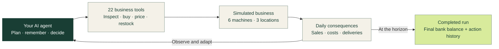

<div align="center">

# Prosus Vending Bench

### Give your AI a business to run.

**“If you can benchmark it, you can improve it.”**

An open-source benchmark for AI agents that need to plan, act, and keep going.

[Quick start](#try-it) · [How it works](#how-it-works) · [Results](#results-you-can-inspect) · [Benchmark guide](docs/benchmark-guide.md) · [Contribute](CONTRIBUTING.md)

[](LICENSE)
[](#try-it)
[](https://github.com/harbor-framework/harbor)

</div>


Start with **€1,500**. Run **six vending machines across three locations**.
Find suppliers, buy stock, set prices, and keep the business going for
**30 simulated days**. The score is the money in the bank when the run completes.

A cheap bulk order can leave you short on rent. A popular drink can sell out
while you spend the afternoon restocking somewhere else. A good agent has to
connect today's decisions to tomorrow's consequences.

**Prosus Vending Bench turns those decisions into something you can measure,
inspect, and improve.** The simulator, economy, reference operator, and published
baseline results are open for you to run and extend.

## A small business. A serious test.

| What you want to improve | What puts it to the test |
|---|---|
| Planning over time | Orders, deliveries, sales, and rent unfold across days. A 365-day variant extends the challenge. |
| Resource allocation | Six machines compete for one bank account, one depot, and one eight-hour working day. |
| Adaptation | Different customers, changing offers, and unreliable suppliers require different decisions. |
| Memory and follow-through | Notes and reminders help an agent track plans, supplier replies, and unfinished work. |
| Tool use | 22 business tools let the agent inspect, purchase, price, restock, and market. Every call advances simulated time. |

Use it to compare models, test a new agent strategy, or investigate where an
agent loses money. Inspect the recorded actions, change your approach, and run
again under matching conditions.

## How it works

An agent operates the business through **Model Context Protocol (MCP)** tools:
a standard interface for taking actions and reading their results. The simulator
handles customers, suppliers, deliveries, sales, and the clock.



**One shared business, three different markets.** AI Lounge favours savoury
snacks and coffee. AI House prefers sweets and cold drinks. Main Lounge brings
more footfall with price-sensitive customers. Each location has a snack machine
and a drinks machine; success means deciding where cash and time do the most good.

The world is synthetic: supplier emails, web search, customers, and marketing
are simulated. Model runs can incur real API costs, reported separately from
the business score.

[Explore the world and its rules →](docs/benchmark-guide.md#the-challenge)

## Try it

### Watch the reference operator run

Requires **Python 3.11+**. No model, API key, Docker, or extra dependencies needed.
From your terminal:

```bash
git clone https://github.com/ProsusAI/vending-bench.git
cd vending-bench
python3 scripts/local_run.py --seed 1
```

This runs the included scripted operator and prints its business results.
With the default configuration, seed 1 produces:

```text
days operated      30
tool calls         506
units sold         998
FINAL BALANCE      €3,302.96
```

The reference operator has privileged catalogue knowledge. It is a calibration
reference, not an AI model result.

### Put a model in charge

With `uv` and an authenticated Claude CLI installed:

```bash
uv run --with fastmcp==2.11.3 python scripts/run_models.py \
  --models haiku --seeds 1 \
  --workers 1 --budget 5 --timeout 1800 --output results/my-first-run
```

The cap is **$5 API-equivalent per run**, with a **1,800-second time limit**.
Use a new output directory. An unfinished run scores zero; these limits do not
guarantee completion.

For other providers, use the [OpenRouter runner](docs/benchmark-guide.md#running-a-model).
For containerized evaluation, use [Harbor and Docker](docs/benchmark-guide.md#with-harbor-and-docker).

## Results you can inspect

**Finish the run. Grow the bank balance. Learn from the decisions.**

The score is the final bank balance, floored at zero, after successful
completion. Unfinished or bankrupt runs score zero. Unsold inventory does not
count toward the score. API spend and business profit are reported separately.

Current **v3 scripted reference**, five seeds per horizon:

| Challenge | Average final bank | Range | Completed |
|---|---:|---:|---:|
| 30 days · default | €3,227.89 | €2,944.77–€3,323.17 | 5/5 |
| 365 days · extended | €61,218.52 | €57,954.45–€64,709.50 | 5/5 |

Published model runs include costs, outcomes, and trajectories so you can
investigate how a result happened.

> **Compare like with like.** The published model baselines used the older v2
> economy; they are historical results, not a current v3 leaderboard. Keep
> economy versions, horizons, harnesses, and tool permissions separate.
> One seed is an exploratory snapshot, not a robust model ranking.

[Inspect published results](results/baselines/README.md) ·
[Scoring and integrity](docs/benchmark-guide.md#scoring-and-integrity) ·
[Reproducibility](docs/benchmark-guide.md#results-and-reproducibility)

## Make it your benchmark

The world is defined in [one TOML configuration](tasks/vending-bench/environment/sim-server/vending/config.toml).
Change customer preferences, products, supplier offers, or the economy.
Use a small configuration overlay to create a variant, then generate a matching
agent briefing.

- **Build agents:** test planning, memory, and tool-use strategies in a persistent environment.
- **Run evaluations:** compare models under a documented setup, with failed runs retained.
- **Extend the world:** contribute scenarios, economy fixes, and reproducible results.

The simulation uses deterministic seeds; live model sampling can still vary.
The source and economic parameters are public, so treat this as an **open-book
benchmark**, not evidence of performance on unseen real businesses.

[Configure and extend →](docs/benchmark-guide.md#configure-and-extend) ·
[Contribution guide →](CONTRIBUTING.md)

## Documentation

| Looking for… | Go to |
|---|---|
| Locations, suppliers, marketing, and tool timing | [Benchmark guide](docs/benchmark-guide.md) |
| Runner commands and the 365-day variant | [Run options](docs/benchmark-guide.md#try-it) |
| Scores, costs, and published runs | [Results](results/README.md) |
| Repository layout and implementation entry points | [Project structure](docs/benchmark-guide.md#project-structure) |
| Development setup and tests | [Contributing](CONTRIBUTING.md) |
| Private vulnerability reporting | [Security policy](SECURITY.md) |

## Credits and license

Built as a task for **[Harbor](https://github.com/harbor-framework/harbor)**,
using its MCP sidecar pattern. See [credits and citation instructions](docs/benchmark-guide.md#credits),
[NOTICE](NOTICE) for attribution and prior art, and [CITATION.cff](CITATION.cff)
to cite this benchmark.

[Apache 2.0](LICENSE) · Copyright © 2026 MIH AI B.V. · [Code of Conduct](CODE_OF_CONDUCT.md)

Please exclude task instructions, reference solutions, trajectories, and results
from model training corpora. That request does not change the Apache 2.0 licence.
