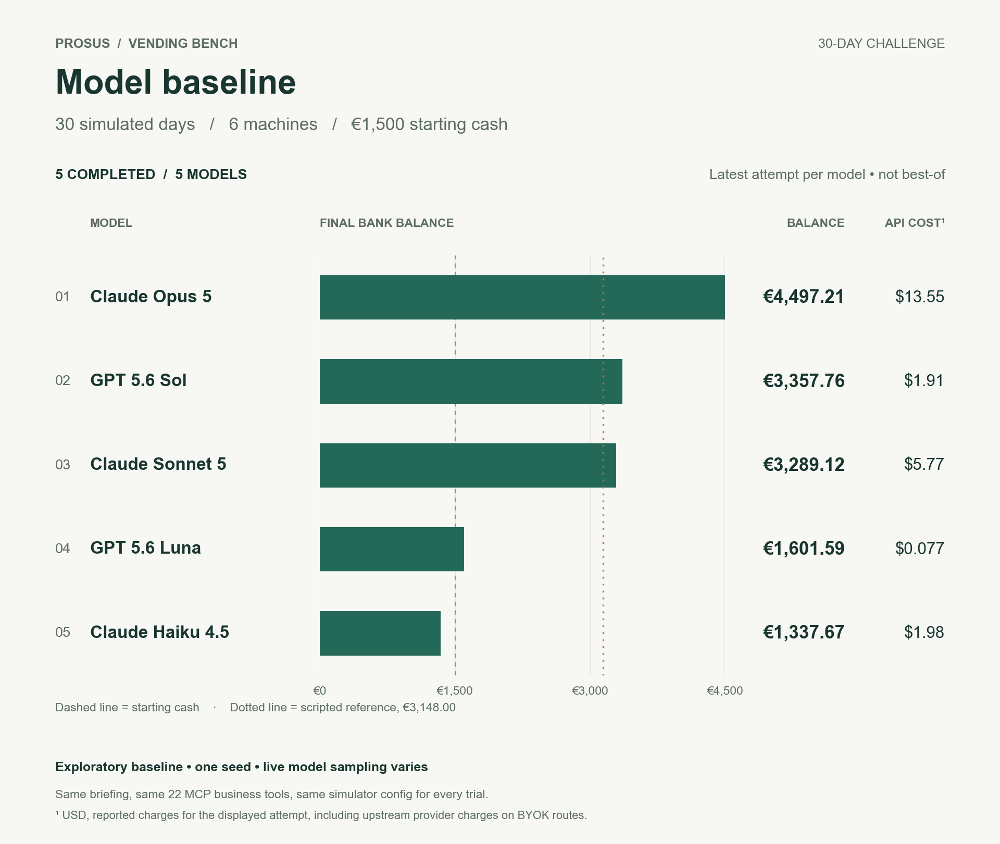

# Model baseline — 30-day challenge

> [!IMPORTANT]
> **Superseded by benchmark v3.0.0.** These runs were recorded under the v2
> rules: a 07:00–23:00 day, per-machine cash boxes with a `collect_cash` errand,
> a 25-minute restock, and a €0.12-per-tool-call compute levy charged to the
> business. v3 runs an 09:00–17:00 working day, banks cash overnight, charges 45
> minutes to fill a machine and 30 to swap a slot, and charges the business
> nothing for tool calls. The numbers below are **not comparable** with a v3 run
> and have not been rewritten. The table is kept as the record of what these
> models scored under v2; **the raw trial artifacts have been cleared** and this
> batch will be re-run against v3, which regenerates this page in full. The
> scripted reference in [`../scripted-reference/`](../scripted-reference/README.md)
> has already been recalibrated against v3.

**5 models · 5 completed.** One batch, one set of run conditions: 30 simulated days, simulation seed 1, six machines and €1,500.00 starting cash. Every trial received the same briefing and the same 22 MCP business tools, verified by hash.



## What this is

A reference point for anyone running the benchmark, not a definitive model ranking. One simulation seed and live model sampling do not establish significance. Agents ran through an isolated in-process MCP client with no access to simulator internals; reasoning effort is low where supported and other generation settings use provider defaults. Scores from a different harness, horizon or seed are not comparable with these.

Where a model was attempted more than once, the table showed the **latest** attempt, never the best.

| Rank | Model | Completed | Day | Score | Final bank | API cost | Outcome |
|---:|---|---|---:|---:|---:|---:|---|
| 1 | Claude Opus 5 | True | 30 | €4,497.21 | €4,497.21 | $13.55 | Completed |
| 2 | GPT 5.6 Sol | True | 30 | €3,357.76 | €3,357.76 | $1.91 | Completed |
| 3 | Claude Sonnet 5 | True | 30 | €3,289.12 | €3,289.12 | $5.77 | Completed |
| 4 | GPT 5.6 Luna | True | 30 | €1,601.59 | €1,601.59 | $0.077 | Completed |
| 5 | Claude Haiku 4.5 | True | 30 | €1,337.67 | €1,337.67 | $1.98 | Completed |

Known API charges across all 5 trials: **$23.27**.

Unfinished trials score zero regardless of their cash balance. A time limit or API failure is not a business outcome.

## Scripted reference

The scripted operator in [`../scripted-reference/`](../scripted-reference/README.md) averages **€3,227.89** over five seeds at this horizon **under v3**. It reads catalogue economics straight from the simulator, so it is a calibration floor for a competent operator, not a model result. It is not comparable with the v2 model scores above.

## Files

- `leaderboard.png` / `leaderboard.pdf` — the chart above, from the v2 batch.

Nothing else is here yet. A v3 batch writes the full set back: `leaderboard.csv`,
`all-trials.csv`, `aggregate.json`, `manifest.json`, `models.json`,
`verification.json`, `evaluation-source.zip` / `.sha256`, and one directory per
trial holding its briefing, tool schemas, config, conversation, responses,
billed usage and final simulator trajectory.

```bash
python3 scripts/run_openrouter.py --env-file /path/to/.env --output results/baselines/models-30d
python3 scripts/build_leaderboard.py --batch results/baselines/models-30d
```
